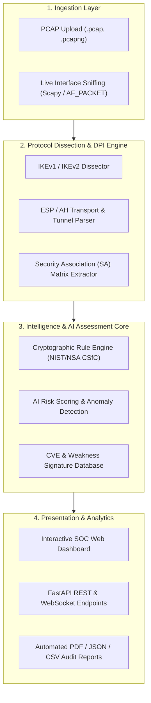

<div align="center">

# Cyber Sentinel
### AI-Powered IPsec VPN Protocol Analysis & Security Assessment Framework
**Developed for Smart India Hackathon (SIH)**

[](https://sih.gov.in)
[](https://www.python.org/)
[](https://fastapi.tiangolo.com/)
[](https://reactjs.org/)
[](LICENSE)
[](https://csrc.nist.gov/publications/detail/sp/800-77/rev-1/final)

<p align="center">
  <strong>Automated VPN Traffic Inspection • Cryptographic Strength Evaluation • AI Risk Scoring • Compliance Audit Reporting</strong>
</p>

---

</div>

## 📌 Table of Contents
- [Executive Overview](#-executive-overview)
- [The Problem & Impact](#-the-problem--impact)
- [Key Features](#-key-features)
- [System Architecture](#-system-architecture)
- [Project Directory Structure](#-project-directory-structure)
- [Technology Stack](#-technology-stack)
- [Installation & Setup](#-installation--setup)
- [Usage Guide](#-usage-guide)
  - [Command-Line Interface (CLI)](#1-command-line-interface-cli)
  - [Interactive SOC Dashboard](#2-interactive-soc-dashboard)
- [Cryptographic & Compliance Standards](#-cryptographic--compliance-standards)
- [Roadmap](#-roadmap)
- [Contributing](#-contributing)
- [License & Acknowledgments](#-license--acknowledgments)

---

## 🌐 Executive Overview

**Cyber Sentinel** is an enterprise-grade, AI-assisted security assessment platform engineered to audit, evaluate, and monitor **IPsec (Internet Protocol Security) VPN tunnels**.

In enterprise and sovereign government networks, IPsec is the de facto standard for site-to-site and remote-access confidentiality. However, misconfigured transforms, deprecated algorithms (e.g., DES/3DES, MD5, low-order Diffie-Hellman groups), and improper SA rekeying frequently leave networks vulnerable to eavesdropping, downgrade exploits, and man-in-the-middle (MITM) attacks.

**Cyber Sentinel** automates the entire lifecycle of IPsec protocol verification:
1. Ingests raw PCAP capture files or live network stream telemetry.
2. Decodes IKEv1/IKEv2 handshakes and ESP/AH protocol negotiations.
3. Quantifies cryptographic strength and identifies security misconfigurations.
4. Uses Machine Learning models to score risk, spot anomalous re-key patterns, and flag anomalous tunnel behaviors.
5. Generates human-readable compliance summaries and remediation guides for security operators.

---

## ⚠️ The Problem & Impact

| Challenge | Traditional Approach | Cyber Sentinel Solution |
| :--- | :--- | :--- |
| **Protocol Auditing** | Manual inspection using Wireshark packet-by-packet | Automated DPI parses entire sessions in milliseconds |
| **Crypto Evaluation** | Static manual review against security advisories | Dynamic policy engine mapping against NIST SP 800-77 & NSA CSfC |
| **Anomaly Detection** | Threshold-based static alarms with high false positives | ML-driven baseline profiling for rekey intervals, jitter, and replay attacks |
| **Audit Reporting** | Days spent creating manual audit documentation | One-click automated PDF/JSON compliance & executive reports |

---

## ✨ Key Features

- **Deep Packet Inspection (DPI) Engine**:
  - Full dissection of **IKEv1** (Main Mode, Aggressive Mode, Quick Mode) and **IKEv2** (IKE_SA_INIT, IKE_AUTH, CREATE_CHILD_SA).
  - Identification of Security Parameter Indexes (SPI), Cookie values, Payload types, Transform types, and proposal matrices.
- **Cryptographic Rigor Assessment**:
  - Evaluation of Encryption Ciphers (`AES-GCM`, `AES-CBC`, `ChaCha20-Poly1305`, `3DES`, `Blowfish`).
  - Integrity & PRF Hash validation (`SHA-256`, `SHA-384`, `SHA-512`, `MD5`, `SHA-1`).
  - Diffie-Hellman Group audits (DH Groups 1, 2, 5 flagged as insecure; DH Groups 14, 19, 20, 21 verified).
  - PFS (Perfect Forward Secrecy) enforcement validation.
- **AI-Powered Risk & Anomaly Scoring**:
  - Multi-factor risk engine producing a unified **Posture Score (0 - 100)**.
  - Anomaly detection targeting packet drop surges, rekey failures, Aggressive Mode credential exposure, and potential replay attacks.
- **Automated Remediation & Reporting**:
  - Generates executive reports with CVSS-aligned severity ratings.
  - Produces remediation snippets for major firewall and gateway vendors (**Cisco IOS**, **Fortinet FortiGate**, **pfSense**, **StrongSwan**, and **Juniper JunOS**).
- **Interactive SOC Dashboard**:
  - Real-time tunnel topology visualizer.
  - Active tunnel health metrics, crypto breakdown charts, and security incident timeline.

---

## 🏗️ System Architecture



---

## 📁 Project Directory Structure

```text
ipsecAIanalyzer-SIH26/
├── backend/
│   ├── app/
│   │   ├── api/                   # REST API routes (endpoints for upload, metrics, reports)
│   │   ├── core/                  # Configuration, logging, and security settings
│   │   ├── engine/                # Core packet processing & DPI engine
│   │   │   ├── ike_parser.py      # IKEv1/IKEv2 dissector
│   │   │   ├── esp_analyzer.py    # ESP/AH payload & integrity checker
│   │   │   └── crypto_eval.py     # Cipher & DH group security validator
│   │   ├── ml/                    # AI/ML anomaly detection models
│   │   │   ├── model.py           # Anomaly detector & risk scorer
│   │   │   └── train.py           # Training pipelines & feature extraction
│   │   ├── reports/               # Report generators (PDF, JSON, HTML)
│   │   └── main.py                # FastAPI application entry point
│   ├── tests/                     # Unit & integration test suites
│   └── requirements.txt           # Backend dependencies
├── frontend/                      # Interactive SOC UI (React / Next.js / Vite)
│   ├── src/
│   │   ├── components/            # Reusable UI widgets & graphs
│   │   ├── pages/                 # Dashboard, Analysis, Reports pages
│   │   └── services/              # API communication layer
│   ├── package.json
│   └── vite.config.js
├── datasets/                      # Sample PCAP captures for verification & tests
│   ├── ikev1_aggressive_mode.pcap
│   ├── ikev2_aes_gcm_sample.pcap
│   └── weak_des_dh2_sample.pcap
├── docs/                          # Architecture diagrams, API specs, and presentations
├── .gitignore
├── LICENSE
└── README.md
```

---

## 🧰 Technology Stack

### **Backend & Core Engine**
- **Language**: Python 3.10+
- **Framework**: FastAPI (Asynchronous high-throughput API)
- **Packet Dissection**: Scapy, PyShark / TShark, dpkt
- **AI / Machine Learning**: Scikit-Learn, PyTorch / XGBoost, Pandas, NumPy
- **Reporting Engine**: WeasyPrint / ReportLab, Jinja2

### **Frontend & Visual Analytics**
- **Framework**: React 18 / Vite or Next.js
- **Styling**: Vanilla CSS / TailwindCSS / Glassmorphic SOC Dark Theme
- **Data Visualization**: Chart.js, Recharts, Cytoscape.js (for network topology)
- **Icons**: Lucide Icons

---

## 🚀 Installation & Setup

### Prerequisites
- **Python**: `3.10` or higher
- **Node.js**: `18.x` or higher (for frontend dashboard)
- **Packet Capture Library**: 
  - **Linux**: `libpcap-dev` (`sudo apt-get install libpcap-dev tshark`)
  - **Windows**: [Npcap](https://npcap.com/) (installed with WinPcap API compatibility)
  - **macOS**: `brew install libpcap wireshark`

---

### 1. Clone the Repository
```bash
git clone https://github.com/KrishJain4234/ipsecAIanalyzer-SIH26.git
cd ipsecAIanalyzer-SIH26
```

### 2. Backend Setup
```bash
# Create and activate virtual environment
python -m venv venv

# Linux/macOS
source venv/bin/activate
# Windows
venv\Scripts\activate

# Install dependencies
cd backend
pip install -r requirements.txt
```

### 3. Frontend Setup
```bash
cd ../frontend
npm install
```

### 4. Running the Application

**Start the Backend Server**:
```bash
# From backend directory
uvicorn app.main:app --reload --host 0.0.0.0 --port 8000
```
*Backend Swagger Docs will be available at:* `http://localhost:8000/docs`

**Start the Frontend Dashboard**:
```bash
# From frontend directory
npm run dev
```
*Frontend UI will be live at:* `http://localhost:5173`

---

## 💻 Usage Guide

### 1. Command-Line Interface (CLI)
Cyber Sentinel can be executed directly as a standalone CLI tool for CI/CD pipelines or headless servers:

```bash
# Analyze a sample PCAP file
python -m app.engine.cli --pcap datasets/weak_des_dh2_sample.pcap --output-format json

# Generate an audit report in PDF
python -m app.engine.cli --pcap datasets/ikev2_aes_gcm_sample.pcap --export-pdf report.pdf
```

### 2. Interactive SOC Dashboard
1. Open `http://localhost:5173` in your browser.
2. Drag and drop any `.pcap` or `.pcapng` capture file into the **Upload Portal**.
3. View real-time parsing results:
   - **Protocol Version**: IKEv1 vs IKEv2 detection.
   - **Encryption & Hash Integrity**: Identified transforms tagged as `SECURE`, `DEPRECATED`, or `CRITICAL`.
   - **Diffie-Hellman Group**: Key-exchange strength assessment.
   - **Posture Score**: Computed risk rating with actionable remediation steps.
4. Export the findings with a single click to an **Executive Summary PDF**.

---

## 📜 Cryptographic & Compliance Standards

Cyber Sentinel evaluates IPsec configurations against recognized cybersecurity benchmarks:

- **NIST SP 800-77 Rev. 1**: *Guide to IPsec VPNs*
- **RFC 7296**: *Internet Key Exchange Protocol Version 2 (IKEv2)*
- **RFC 4301 / 4303**: *Security Architecture for the Internet Protocol & ESP*
- **NSA Commercial National Security Algorithm (CNSA) Suite**: Quantum-resistant migration standards.
- **ANSSI / BSI VPN Guidelines**: European national technical guidance for secure IPsec tunnels.

---

## 🗺️ Roadmap

- [x] Core IKEv1 and IKEv2 payload extraction engine.
- [x] Cryptographic policy auditor and posture scoring.
- [x] Interactive web dashboard prototype.
- [ ] Post-Quantum Cryptography (PQC) hybrid key exchange detection (ML-KEM, Kyber).
- [ ] Automated firewall configuration generator (export hardened configurations for Cisco, Fortinet, and StrongSwan).
- [ ] Live distributed capture agents for enterprise multi-site VPN gateways.

---

## 🤝 Contributing

Contributions are welcome! If you would like to improve parser coverage, add protocol dissectors, or refine ML anomaly algorithms:

1. Fork the repository.
2. Create your feature branch (`git checkout -b feature/NewTransformParser`).
3. Commit your changes (`git commit -m "Add parser for ChaCha20-Poly1305"`).
4. Push to the branch (`git push origin feature/NewTransformParser`).
5. Open a Pull Request.

---
